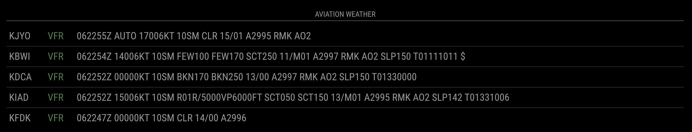

# MMM-METAR

A module for the [MagicMirror](https://github.com/MichMich/MagicMirror) project to fetch and display METAR data.



## Installation

```bash
cd ~/MagicMirror/modules
git clone https://github.com/The-Better-Aviator/MMM-METAR
cd MMM-METAR
npm install
```

Add the following to your `/config/config.js` file:

```js
    {
      module: 'MMM-METAR',
      position: 'bottom_bar',
      header: 'Aviation Weather',
      config: {
        airports: ['KFDK','KJYO','KIAD','KDCA','KBWI'],
        useColor: false,
        useSort: 'array',
      },
    },
```

## Config Options

| Option   | Required              | Type   | Description                                                                                                                                                                                                                                                                      |
| -------- | --------------------- | ------ | -------------------------------------------------------------------------------------------------------------------------------------------------------------------------------------------------------------------------------------------------------------------------------- |
| airports | YES                   | Array  | Any ICAO code. To check if it will return a value, you can test it here (replace `KORD` with the airport you want to test): `https://beta.aviationweather.gov/cgi-bin/data/metar.php?ids=KORD&format=json`                                                                       |
| useColor | No (Default: `false`) | Bool   | Adds colors to the flight category identifiers using the FAA specification (desaturated by 50%, darkened by 25%: <span style="color:#bf60bf">LIFR</span> <span style="color:#bf6060">IFR</span> <span style="color:#6060bf">MVFR</span> <span style="color:#60bf60">VFR</span>). |
| useSort  | No (Default: `array`) | String | Sets the sort type to either `array` or `alpha`, where `array` lists the airports in the order they appear in your `/config/config.js` file, and `alpha` is an alphabetical sort.                                                                                                |
